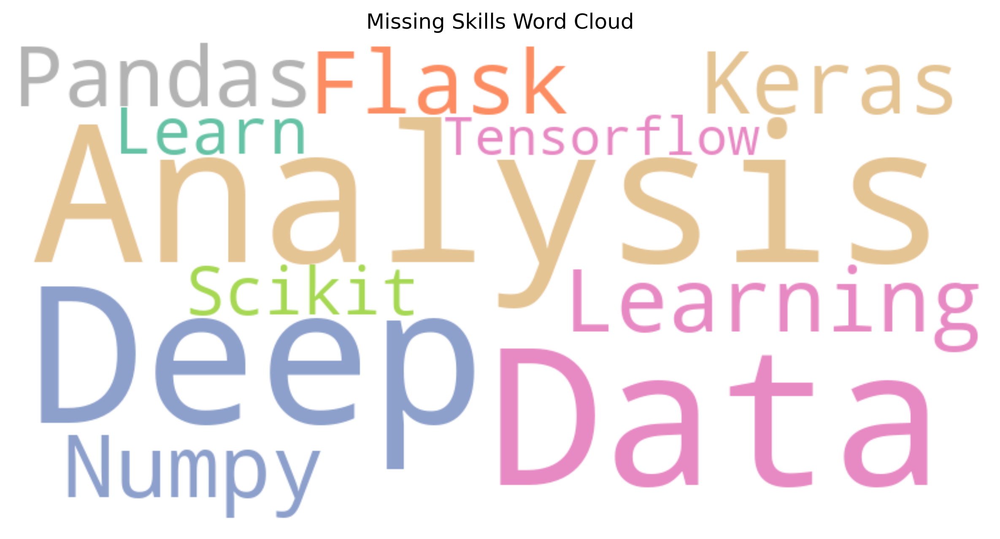

# 🧑‍💻 AI-Powered Job Skill Gap Analyzer

An AI-powered pipeline to automatically analyze your skill gaps for any job by comparing your resume and a JD using NLP, visualizing matched and missing skills, and providing actionable insights.

---

## 🚀 Features
✅ Upload **Resume and JD PDFs** directly.  
✅ Automatically extract and clean text using NLP.  
✅ Extract skills from your resume and JD using a skill keyword list.  
✅ Perform **skill gap analysis**: Matched vs Missing skills.  
✅ Visualize results with:
- Bar Chart
- Pie Chart
- Word Cloud

✅ Streamlit dashboard for a **clean, interactive demo.**

---

## 🛠️ Tech Stack
- Python
- Streamlit
- pdfplumber
- spaCy
- matplotlib, seaborn
- wordcloud
- Git & GitHub

---

## 📸 Screenshots

### Dashboard Upload


### Word Cloud of Missing Skills


---

## ⚙️ Setup Instructions

1️⃣ Clone the repository:
```bash
git clone <repo-link>
cd ai-job-skill-gap-analyzer
